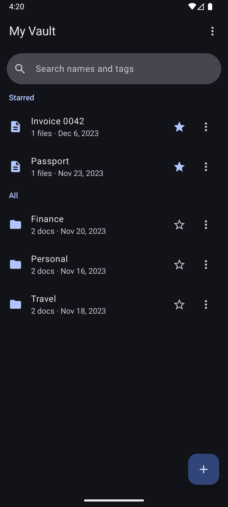
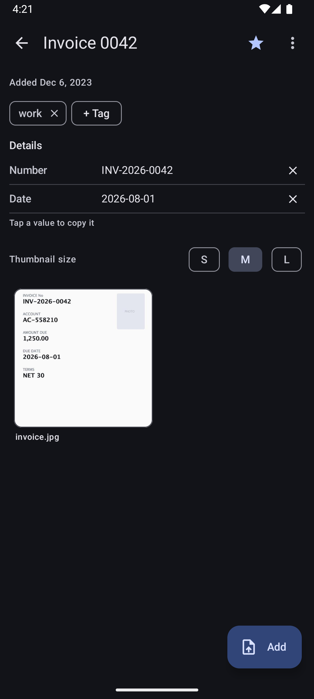
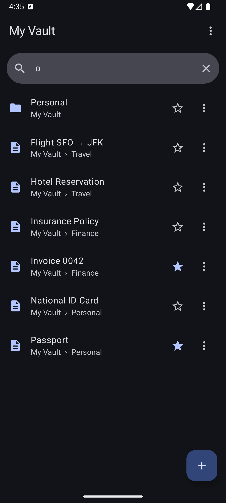
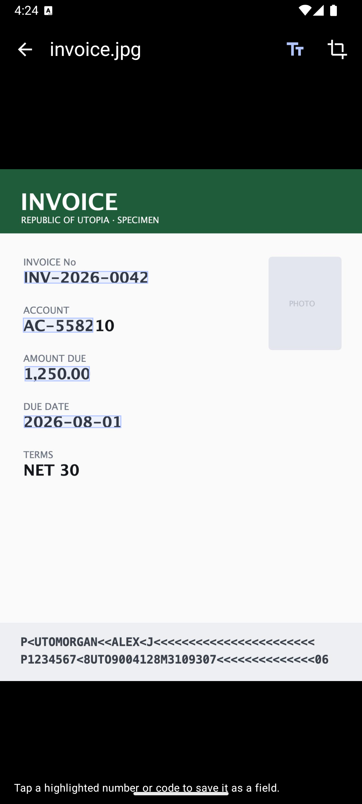
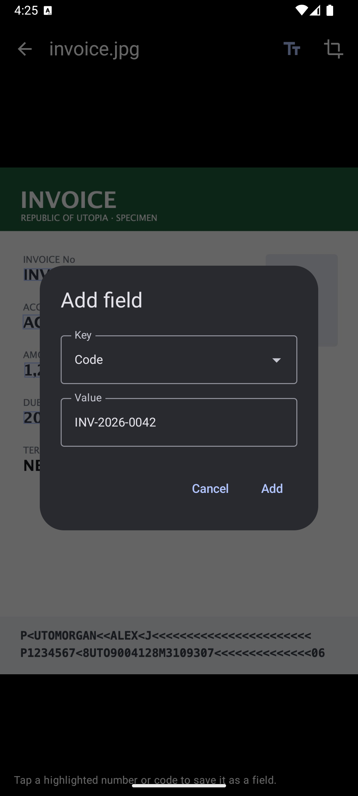
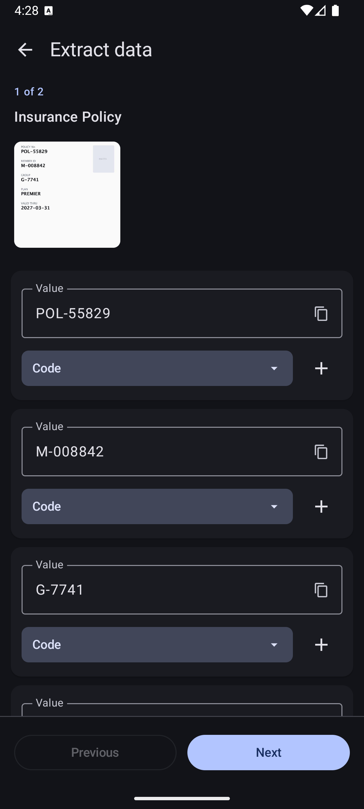
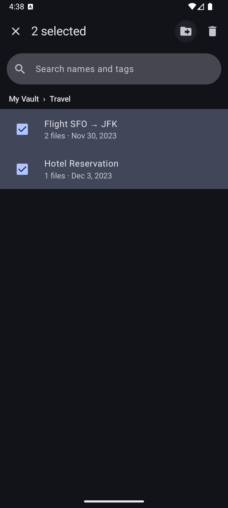
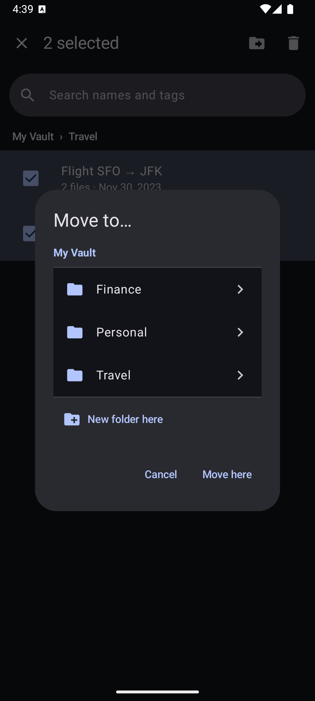
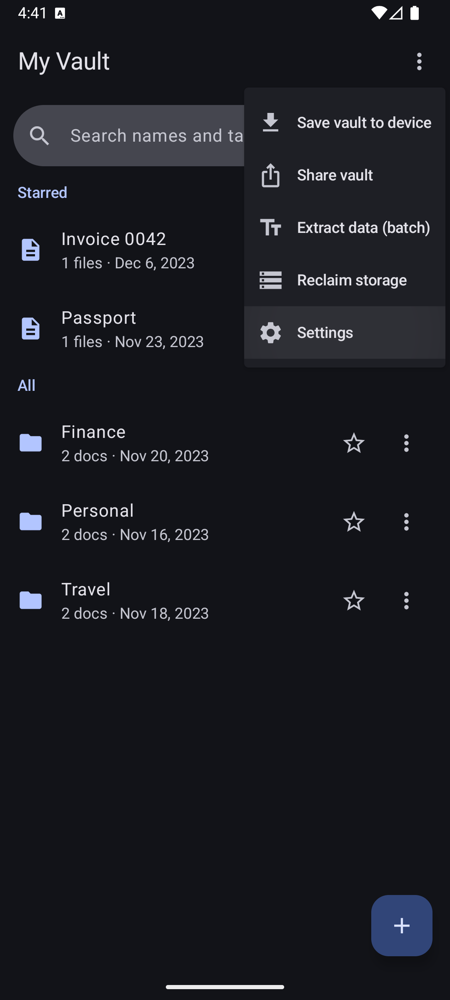
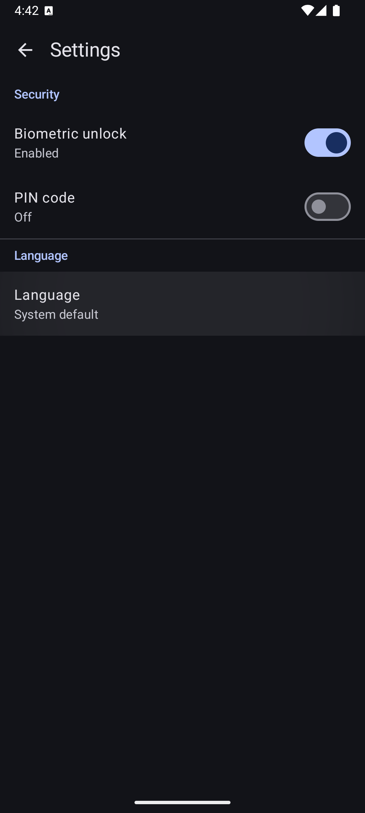

# DocSafe

**A private, offline-first document vault for Android.** Organize scanned documents into a
folder tree, attach photos / PDFs / any file, and keep everything inside a **single,
password-encrypted file** that you fully control. No accounts, no servers — your documents
never leave your device unless you explicitly export or share them.

> Built with Kotlin + Jetpack Compose (Material 3), a fully unit-tested cryptographic core, and
> on-device OCR. Available in 17 languages.

---

## Why DocSafe

Most "document scanner" apps either store your IDs and certificates in plain files or sync them
to someone else's cloud. DocSafe takes the opposite stance:

- **Everything is in one encrypted file.** The entire folder structure, every attachment, and
  all thumbnails live inside a single `.dsvault` file encrypted with AES‑256‑GCM.
- **You hold the only key.** A master password (run through Argon2id) is the sole way in. There
  is no recovery, no backdoor, and no telemetry.
- **It works completely offline.** OCR, scanning, previews, and search all run on-device.
- **It's designed to be shared deliberately.** Hand the encrypted file to family members who
  know the password; each device unlocks locally with biometrics or a PIN afterwards.

---

## Screenshots

> All screenshots use synthetic, non-personal sample documents.

| Folder browser | Document detail | Search by name & tag |
| --- | --- | --- |
|  |  |  |
| Starred section, folders & documents, slick search bar. | Key/value fields, tags, and in-vault thumbnails. | Results show each item's folder path. |

| OCR field extraction | Save detected field | Batch extraction |
| --- | --- | --- |
|  |  |  |
| On-device OCR boxes every number/code — tap to grab it. | Tapping a box pre-fills the add-field dialog. | Step through documents and assign values to keys. |

| Multi-select | Move to folder | Onboarding & security |
| --- | --- | --- |
|  |  |  |
| Select documents/folders for bulk actions. | Pick or create a destination subfolder. | Master password with a plain-language warning. |

| Settings | 17 languages |
| --- | --- |
|  |  |
| Manage unlock methods and language. | In-app picker; defaults to the system language. |

---

## Features

### Organize
- **Folder tree** with create / rename / delete and breadcrumbs.
- **Documents** that hold one or more attachments plus typed **key/value fields** (e.g.
  *Number*, *Date*, *Code*, or your own keys).
- **Attach anything** — multi-select photos, PDFs, or arbitrary files.
- **Tags**, a **Starred** section, and **added-on dates**.
- **Search** by name and tag; results show each item's **folder path** so same-named documents
  are easy to tell apart.
- **Move** documents and folders (multi-select or per-item) into existing or newly-created
  subfolders, with a destination picker.

### Capture & preview
- **Document scanner** (ML Kit), **camera**, **photo library**, or any-file import.
- **Thumbnails stored inside the vault** (regenerated on demand if missing), EXIF-oriented, with
  high-quality PDF first-page rendering.
- **Full-screen viewer** with pinch-to-zoom and swipe between a document's images; open or share
  any attachment externally.

### On-device OCR (field extraction)
- In the viewer, an **Extract text** mode auto-detects "field-like" numbers, dates, and codes
  and outlines them as **tappable boxes** — tap one to copy it and save it as a key/value field.
- A **select-an-area** fallback OCRs any region you draw a box over.
- **Batch mode** steps through every image document under a folder, runs OCR on each, and lets
  you quickly assign detected values to keys (editable values, reusable custom keys, undo).
- All recognition runs **locally** via ML Kit Text Recognition — nothing is uploaded.

### Security & privacy
- **Master-password import**, then **biometric / device-credential or PIN** unlock on each
  launch (Android Keystore-wrapped keys; PIN derived with Argon2id).
- **Locks on background** with a short grace period; onboarding nudges you to enable at least one
  unlock method.
- **No password recovery by design** — strong protection means a forgotten password is final.

### Share, export & maintenance
- **Export / share the encrypted `.dsvault`** file; DocSafe registers as an opener for
  `.dsvault` files so importing on another device is one tap.
- **Be a share target** — send files or pictures from other apps into DocSafe and pick/create a
  destination document.
- **Reclaim storage** — compaction drops unreferenced blobs from the vault file.

### Localization
- 17 languages: English, Russian, French, German, Chinese (Simplified), Japanese, Armenian,
  Georgian, Persian, Italian, Spanish, Portuguese, Polish, Bulgarian, Swedish, Finnish,
  Norwegian Bokmål — with an in-app language picker (defaults to the system language).

---

## How the encrypted vault works

A vault can grow to hundreds of megabytes, yet the common operation is "open one photo out of
dozens." So the file is **seekable in its encrypted form** — you can read the structure with the
password and then decrypt a *single* blob without reading the whole file.

```
offset 0:  magic "DSVAULT" | version | headerLen | header (cleartext JSON)
           header = { kdf{argon2id, m,t,p, salt}, cipher "AES-256-GCM",
                      wrappedDek, indexOffset, indexLength, indexNonce }
... BLOB REGION ...  each attachment encrypted independently (chunked AES-GCM),
                     written at a known [encOffset, encLength]
[ indexOffset ]:  ENCRYPTED INDEX (AES-256-GCM under the DEK)  ← the "pseudo filesystem"
```

- **Two-layer keys:** password → (Argon2id) **KEK** → unwraps a random **DEK**. The index and
  every blob are encrypted under the DEK. This is what lets a device re-wrap the DEK with a
  Keystore key after import, so the master password isn't needed again.
- **Content-addressed blobs:** `blobId = SHA-256(plaintext)`, so identical content is stored
  once; only the index references change.
- **Append-on-write / log-structured:** adding attachments appends new encrypted blobs and writes
  a fresh index — the existing hundreds of MB are never rewritten. Deletes are index tombstones;
  **compaction** reclaims the garbage on demand.
- **Merge-ready:** entities use per-record last-writer-wins with tombstones, so the same vault
  can be reconciled across devices (the foundation for future shared-file sync).

> File reads go through a small `VaultStore` abstraction (`read(offset,length)` / `append` /
> `writeAt`). The same seek logic that works on a local file is designed to work over HTTP
> **Range** requests, which is how a future Google Drive backend would fetch only the header,
> index, and one blob — never the whole file.

---

## No network access

DocSafe requests **no internet permission at all**. Its merged manifest declares only
`USE_BIOMETRIC` / `USE_FINGERPRINT` — there is **no `android.permission.INTERNET`** (the ML Kit /
Play Services libraries declare it transitively, so it is explicitly stripped from the manifest).

This is an **OS-enforced** guarantee, not a promise: Android only grants a process network
sockets if its package holds `INTERNET`, so DocSafe's own code physically cannot open a network
connection. Anyone can confirm it from the APK:

```bash
aapt dump permissions docsafe-<version>.apk      # no android.permission.INTERNET
```

On-device scanning and OCR still work — they run inside **Google Play Services** (a separate
process with its own networking), so removing DocSafe's network access doesn't affect them.

The only way data leaves the device is if **you** explicitly use the export / share action,
which hands a file to another app of your choosing.

## Verifiable builds

Because DocSafe holds sensitive documents, you shouldn't have to *trust* that the published app
matches this source — you can **check it**.

- **Reproducible:** two clean builds of the same tag produce a **byte-for-byte identical** APK.
  The toolchain is pinned (Gradle wrapper + version catalog), the version is fixed, and the
  non-deterministic AGP "dependencies info" blob is disabled.
- **One-command verification:** rebuild from a release tag and run
  [`tools/verify-apk.sh <official.apk>`](tools/verify-apk.sh). It compares the APK contents
  (ignoring only the signature, which differs per signing key) and reports `MATCH ✅` or the
  exact differing entries. Full guide: **[VERIFYING.md](VERIFYING.md)**.
- **Signed chain:** each release is a **GPG-signed git tag** with a matching **GitHub Release**
  that publishes the reproducibly-built APK and its `SHA256SUMS`.

Note on Google Play: Play re-signs uploads with **Play App Signing**, so the Play-delivered APK
won't be byte-identical to a local build. The **GitHub Release APK** (built from the same signed
tag) is therefore the artifact to verify against. See [VERIFYING.md](VERIFYING.md) and
[BUILDING.md](BUILDING.md).

---

## Tech stack

- **Kotlin**, **Jetpack Compose** + **Material 3**, single-Activity MVVM.
- **Hilt** (DI), **Coroutines / Flow**, **kotlinx.serialization**.
- **Cryptography:** Bouncy Castle **Argon2id** (pure-JVM, so the core is unit-testable without a
  device) + JCA **AES-256-GCM**; Android **Keystore** + **EncryptedSharedPreferences** for local
  key wrapping.
- **ML Kit** Document Scanner + Text Recognition (on-device).
- `minSdk 26`, `compileSdk` / `targetSdk 36`.

### Module layout

```
:core:crypto   Pure-Kotlin/JVM — Argon2id KDF, chunked AES-256-GCM, envelope (KEK→DEK) keys
:core:vault    Pure-Kotlin/JVM — domain model, seekable vault format, merge engine
:core:sync     VaultStore abstraction (local file now; Drive backend later)
:app           Compose UI, Hilt graph, auth/Keystore, scanning, thumbnails, OCR, share
```

Keeping crypto and the vault format in pure-JVM modules means the security-critical logic is
covered by fast host unit tests (no emulator required).

---

## Building

Requirements: **JDK 17** and the **Android SDK** (platform 36, build-tools 35.0.0).

```bash
# Run the JVM unit tests (crypto + vault format + merge + concurrency)
./gradlew :core:crypto:test :core:vault:test

# Build a debug APK and install on a connected device/emulator
./gradlew :app:installDebug

# Build the release APK (unsigned unless keystore.properties is present)
./gradlew :app:assembleRelease
```

The exact pinned toolchain, the release-signing setup, and how releases are cut are documented
in **[BUILDING.md](BUILDING.md)**. Release signing reads a local `keystore.properties` + `.jks`
that are **git-ignored and never committed**.

---

## Testing

- **JVM unit tests** (`:core:*`): Argon2id determinism, chunked AES-GCM round-trips and negative
  cases, the seekable format (write many blobs, decrypt one by seeking), append/compaction, the
  merge matrix, and concurrent-read safety of the file store.
- **Instrumented tests** (`:app`): Keystore wrap/unwrap and vault flows on a device/emulator.

---

## Roadmap

- **Google Drive sync** as the shared source of truth (the vault format is already seekable for
  HTTP Range reads + resumable append-uploads; needs a Google Cloud OAuth client).
- More OCR tuning and additional recognizer scripts.

---

## Privacy

DocSafe has no analytics, no ads, and makes no network calls for its core features. Documents,
OCR text, and previews stay on the device. The encrypted vault leaves the device only when you
explicitly export or share it.

You don't have to take that on trust — the app is open source and builds reproducibly, so anyone
can confirm the released binary matches this source (see [Verifiable builds](#verifiable-builds)).

Suggested Google Play description blurb:

> **Open source & verifiable.** DocSafe works fully offline and stores your documents in a single
> encrypted file that never leaves your device unless you export it. It requests **no internet
> permission**, so the app physically cannot send your data anywhere. The complete source is on
> GitHub, and every release is built reproducibly from a signed tag — anyone can rebuild the app
> and confirm it matches the published code.

---

## License

Released under the [MIT License](LICENSE) © 2026 Dmitry Duka.
