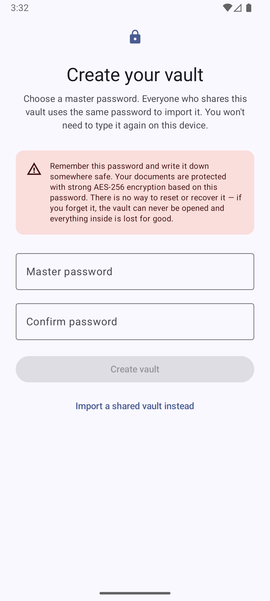

# DocSafe

**A private, offline-first document vault for Android.** Organize scanned documents into a
folder tree, attach photos / PDFs / any file, and keep everything inside a **single,
password-encrypted file** that you fully control. No accounts, no servers — your documents
never leave your device unless you explicitly export or share them.

> Built with Kotlin + Jetpack Compose (Material 3), a fully unit-tested cryptographic core, and
> on-device OCR. Available in 17 languages.

---

## Why DocSafe

Most "document scanner" apps either store your IDs and certificates in plain files or sync them
to someone else's cloud. DocSafe takes the opposite stance:

- **Everything is in one encrypted file.** The entire folder structure, every attachment, and
  all thumbnails live inside a single `.dsvault` file encrypted with AES‑256‑GCM.
- **You hold the only key.** A master password (run through Argon2id) is the sole way in. There
  is no recovery, no backdoor, and no telemetry.
- **It works completely offline.** OCR, scanning, previews, and search all run on-device.
- **It's designed to be shared deliberately.** Hand the encrypted file to family members who
  know the password; each device unlocks locally with biometrics or a PIN afterwards.

---

## Screenshots



The onboarding makes the security model explicit up front: choose a master password (with a
plain-language warning that it can't be recovered), then pick at least one quick unlock method
(biometrics / device credential, or a PIN).

*More screenshots — folder browser, document detail, in-app viewer, OCR field extraction and
batch mode — can be dropped into `docs/screenshots/` and linked here.*

---

## Features

### Organize
- **Folder tree** with create / rename / delete and breadcrumbs.
- **Documents** that hold one or more attachments plus typed **key/value fields** (e.g.
  *Number*, *Date*, *Code*, or your own keys).
- **Attach anything** — multi-select photos, PDFs, or arbitrary files.
- **Tags**, a **Starred** section, and **added-on dates**.
- **Search** by name and tag; results show each item's **folder path** so same-named documents
  are easy to tell apart.
- **Move** documents and folders (multi-select or per-item) into existing or newly-created
  subfolders, with a destination picker.

### Capture & preview
- **Document scanner** (ML Kit), **camera**, **photo library**, or any-file import.
- **Thumbnails stored inside the vault** (regenerated on demand if missing), EXIF-oriented, with
  high-quality PDF first-page rendering.
- **Full-screen viewer** with pinch-to-zoom and swipe between a document's images; open or share
  any attachment externally.

### On-device OCR (field extraction)
- In the viewer, an **Extract text** mode auto-detects "field-like" numbers, dates, and codes
  and outlines them as **tappable boxes** — tap one to copy it and save it as a key/value field.
- A **select-an-area** fallback OCRs any region you draw a box over.
- **Batch mode** steps through every image document under a folder, runs OCR on each, and lets
  you quickly assign detected values to keys (editable values, reusable custom keys, undo).
- All recognition runs **locally** via ML Kit Text Recognition — nothing is uploaded.

### Security & privacy
- **Master-password import**, then **biometric / device-credential or PIN** unlock on each
  launch (Android Keystore-wrapped keys; PIN derived with Argon2id).
- **Locks on background** with a short grace period; onboarding nudges you to enable at least one
  unlock method.
- **No password recovery by design** — strong protection means a forgotten password is final.

### Share, export & maintenance
- **Export / share the encrypted `.dsvault`** file; DocSafe registers as an opener for
  `.dsvault` files so importing on another device is one tap.
- **Be a share target** — send files or pictures from other apps into DocSafe and pick/create a
  destination document.
- **Reclaim storage** — compaction drops unreferenced blobs from the vault file.

### Localization
- 17 languages: English, Russian, French, German, Chinese (Simplified), Japanese, Armenian,
  Georgian, Persian, Italian, Spanish, Portuguese, Polish, Bulgarian, Swedish, Finnish,
  Norwegian Bokmål — with an in-app language picker (defaults to the system language).

---

## How the encrypted vault works

A vault can grow to hundreds of megabytes, yet the common operation is "open one photo out of
dozens." So the file is **seekable in its encrypted form** — you can read the structure with the
password and then decrypt a *single* blob without reading the whole file.

```
offset 0:  magic "DSVAULT" | version | headerLen | header (cleartext JSON)
           header = { kdf{argon2id, m,t,p, salt}, cipher "AES-256-GCM",
                      wrappedDek, indexOffset, indexLength, indexNonce }
... BLOB REGION ...  each attachment encrypted independently (chunked AES-GCM),
                     written at a known [encOffset, encLength]
[ indexOffset ]:  ENCRYPTED INDEX (AES-256-GCM under the DEK)  ← the "pseudo filesystem"
```

- **Two-layer keys:** password → (Argon2id) **KEK** → unwraps a random **DEK**. The index and
  every blob are encrypted under the DEK. This is what lets a device re-wrap the DEK with a
  Keystore key after import, so the master password isn't needed again.
- **Content-addressed blobs:** `blobId = SHA-256(plaintext)`, so identical content is stored
  once; only the index references change.
- **Append-on-write / log-structured:** adding attachments appends new encrypted blobs and writes
  a fresh index — the existing hundreds of MB are never rewritten. Deletes are index tombstones;
  **compaction** reclaims the garbage on demand.
- **Merge-ready:** entities use per-record last-writer-wins with tombstones, so the same vault
  can be reconciled across devices (the foundation for future shared-file sync).

> File reads go through a small `VaultStore` abstraction (`read(offset,length)` / `append` /
> `writeAt`). The same seek logic that works on a local file is designed to work over HTTP
> **Range** requests, which is how a future Google Drive backend would fetch only the header,
> index, and one blob — never the whole file.

---

## Tech stack

- **Kotlin**, **Jetpack Compose** + **Material 3**, single-Activity MVVM.
- **Hilt** (DI), **Coroutines / Flow**, **kotlinx.serialization**.
- **Cryptography:** Bouncy Castle **Argon2id** (pure-JVM, so the core is unit-testable without a
  device) + JCA **AES-256-GCM**; Android **Keystore** + **EncryptedSharedPreferences** for local
  key wrapping.
- **ML Kit** Document Scanner + Text Recognition (on-device).
- `minSdk 26`, `compileSdk` / `targetSdk 36`.

### Module layout

```
:core:crypto   Pure-Kotlin/JVM — Argon2id KDF, chunked AES-256-GCM, envelope (KEK→DEK) keys
:core:vault    Pure-Kotlin/JVM — domain model, seekable vault format, merge engine
:core:sync     VaultStore abstraction (local file now; Drive backend later)
:app           Compose UI, Hilt graph, auth/Keystore, scanning, thumbnails, OCR, share
```

Keeping crypto and the vault format in pure-JVM modules means the security-critical logic is
covered by fast host unit tests (no emulator required).

---

## Building

Requirements: **JDK 17+** (the project targets JVM 17) and the **Android SDK** (platform 36).

```bash
# Run the JVM unit tests (crypto + vault format + merge + concurrency)
./gradlew :core:crypto:test :core:vault:test

# Build a debug APK and install on a connected device/emulator
./gradlew :app:installDebug
```

### Release signing

Release builds are signed from a local `keystore.properties` (and a `.jks` keystore) that are
**git-ignored and never committed**. Create your own:

```bash
keytool -genkeypair -v -keystore docsafe-release.jks \
  -keyalg RSA -keysize 2048 -validity 10000 -alias docsafe
```

`keystore.properties` (in the project root):

```properties
storeFile=docsafe-release.jks
storePassword=********
keyAlias=docsafe
keyPassword=********
```

Then:

```bash
./gradlew :app:assembleRelease   # signed APK
./gradlew :app:bundleRelease     # AAB for Google Play
```

If `keystore.properties` is absent, the release build still compiles but is left unsigned.

---

## Testing

- **JVM unit tests** (`:core:*`): Argon2id determinism, chunked AES-GCM round-trips and negative
  cases, the seekable format (write many blobs, decrypt one by seeking), append/compaction, the
  merge matrix, and concurrent-read safety of the file store.
- **Instrumented tests** (`:app`): Keystore wrap/unwrap and vault flows on a device/emulator.

---

## Roadmap

- **Google Drive sync** as the shared source of truth (the vault format is already seekable for
  HTTP Range reads + resumable append-uploads; needs a Google Cloud OAuth client).
- More OCR tuning and additional recognizer scripts.

---

## Privacy

DocSafe has no analytics, no ads, and makes no network calls for its core features. Documents,
OCR text, and previews stay on the device. The encrypted vault leaves the device only when you
explicitly export or share it.

---

## License

Released under the [MIT License](LICENSE) © 2026 Dmitry Duka.
